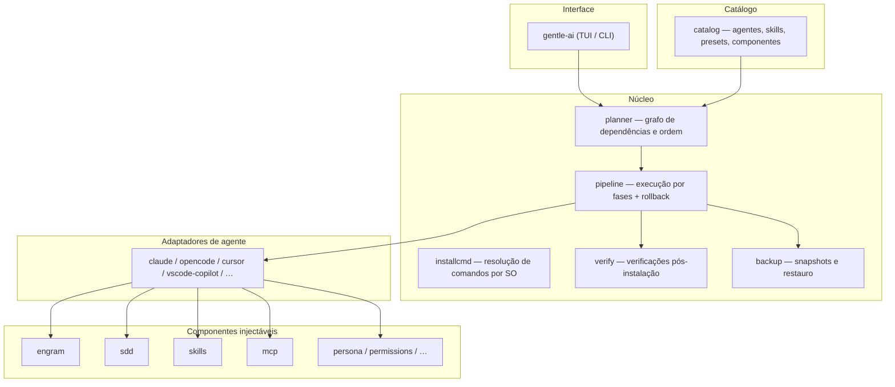
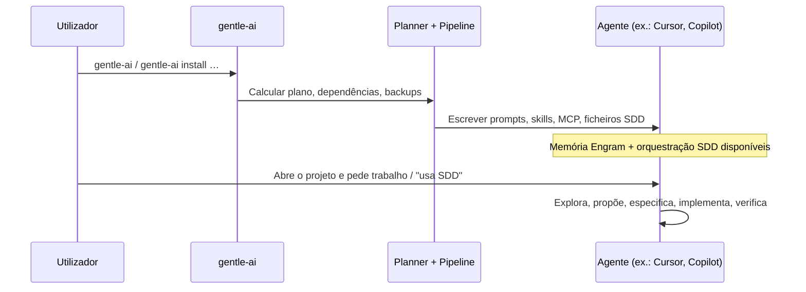
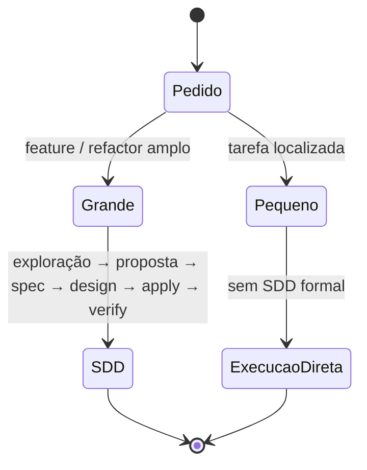
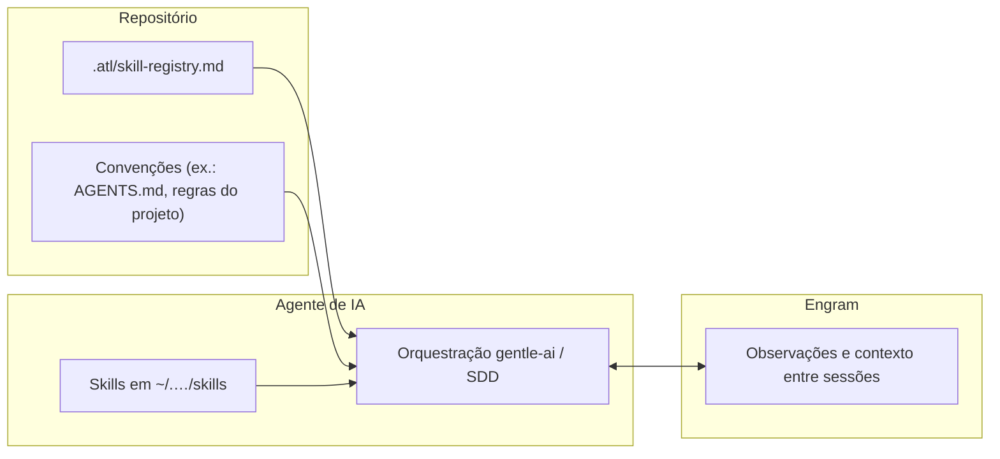
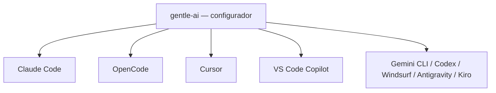

# Relatório: como funciona o **gentle-ai**

**Agent-Orchestrator** — documento exportado.

*Documentação de referência:* [repositório gentle-ai — pasta `docs/`](https://github.com/Gentleman-Programming/gentle-ai/tree/main/docs)

---

## 1. Resumo executivo

O **gentle-ai** é um **configurador do ecossistema Gentleman** para ferramentas de desenvolvimento assistido por IA. **Não substitui** a instalação do Claude Code, Cursor, VS Code Copilot, OpenCode, etc.: **prepara** esses agentes com **memória persistente (Engram)**, **fluxo SDD (Spec-Driven Development)**, **skills**, **servidores MCP**, **persona**, permissões e outros componentes, de forma **repetível** entre projetos e máquinas.

Após a configuração inicial, o modelo mental pretendido é: **abre o agente no projeto e trabalha**; o SDD e a memória entram **quando faz sentido** (tarefas maiores ou quando pedes explicitamente).

---

## 2. O que é / o que não é

| É | Não é |
|---|--------|
| Orquestrador de **configuração** (ficheiros, prompts, skills, MCP) | Um motor de IA que executa o teu código por si |
| Camada comum (memória + SDD + convenções) sobre vários agentes | Substituto do GitHub Copilot / Cursor / Claude Code |
| Instalador de **integrações** (Engram, GGA, etc., conforme preset) | Apenas um catálogo de modelos |

---

## 3. Visão geral da arquitetura (código e módulos)

O próprio projeto descreve uma estrutura em Go: entrada na CLI, catálogo, planeamento, componentes por agente, pipeline com rollback e verificação.

---

## 4. Fluxo lógico: do utilizador ao agente configurado

---

## 5. SDD (Spec-Driven Development) no modelo mental

O SDD organiza trabalho **substancial** em fases (explorar, propor, especificar, desenhar, implementar, verificar). Em tarefas pequenas, o agente pode **ignorar a cerimónia** e executar diretamente; em tarefas grandes, sugere ou segue o fluxo estruturado.

**Delegação:** conforme o agente, as fases podem correr em **subagentes** (contexto isolado) ou **inline** na mesma conversa; a documentação distingue agentes com delegação completa vs. «solo-agent».

---

## 6. Memória (Engram) e skills (duas camadas)

- **Engram:** memória persistente entre sessões (decisões, bugs, descobertas), normalmente via ferramentas MCP (`mem_save`, `mem_search`, …).
- **Skills:** regras e fluxos reutilizáveis; o **skill registry** (ex.: `.atl/skill-registry.md` no projeto) resume o que está instalado e os *triggers*, para o orquestrador e subagentes alinharem com o repositório.

---

## 7. Agentes suportados (visão resumida)

A matriz oficial lista vários agentes (Claude Code, OpenCode, Gemini CLI, Cursor, VS Code Copilot, Codex, Windsurf, Antigravity, Kiro), com variações em **skills**, **MCP**, **delegação** e **multi-modo SDD** (por exemplo, perfis por fase em OpenCode / Kiro, conforme a documentação).

---

## 8. Operação corrente (após instalar)

1. **Instalar** o binário `gentle-ai` (Homebrew, Scoop, script, Go install ou release, conforme o teu SO).
2. **`gentle-ai install`** (ou TUI `gentle-ai`) escolhendo **agente(s)**, **preset** e **componentes**.
3. **Abrir** o agente no projeto e trabalhar; para mudanças grandes, usar SDD («usa SDD», etc.).
4. **`gentle-ai sync`** após atualizar o `gentle-ai`, para alinhar prompts/skills/MCP à versão nova.
5. Opcional no projeto: fluxos como **`/sdd-init`** e **`skill-registry`** quando o stack ou as skills mudarem (recomendado na documentação do README).

---

## 9. Conclusão

O **gentle-ai** funciona como **camada de produtividade e governação** em cima do agente que já utilizas: **injeta** práticas (SDD), **persistência** (Engram) e **extensões** (MCP, skills, persona), com **caminhos distintos por produto** (adaptadores). O valor principal é **padronizar** o modo como a IA trabalha contigo e com o repositório, **sem** substituir o runtime do editor ou do serviço Copilot.

---

## Fontes

*Fonte consolidada:* [Gentleman-Programming/gentle-ai — documentação](https://github.com/Gentleman-Programming/gentle-ai/tree/main/docs) (inclui `architecture.md`, `agents.md`, `intended-usage.md`, `platforms.md`, `usage.md`).
