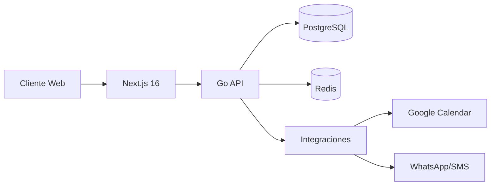
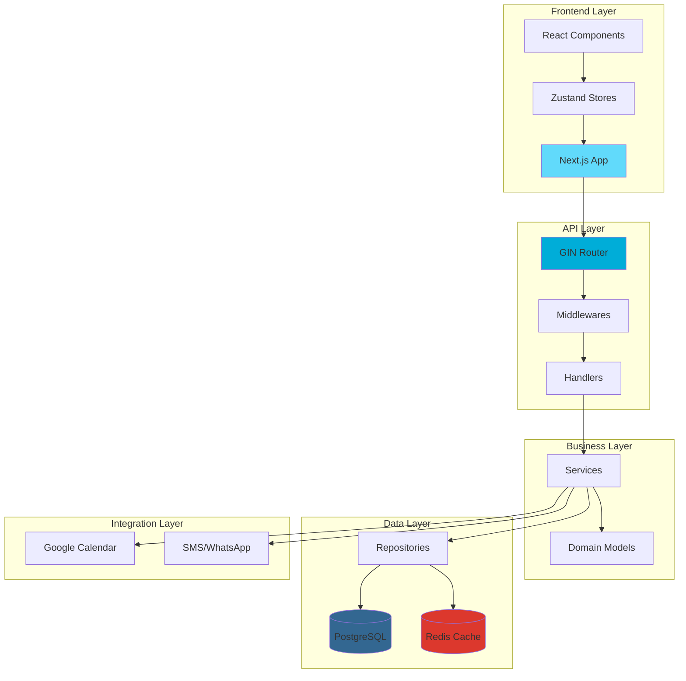
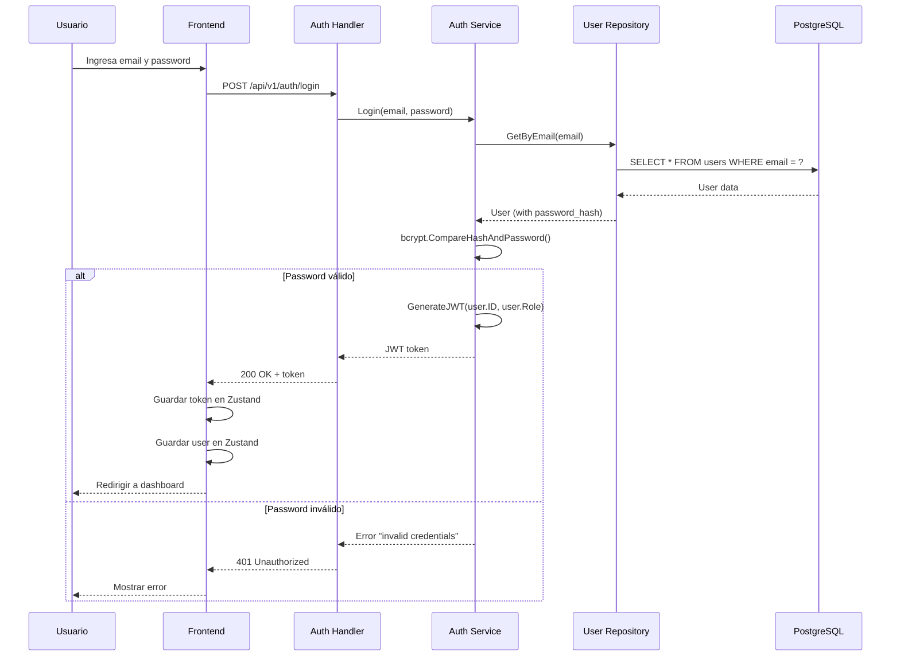
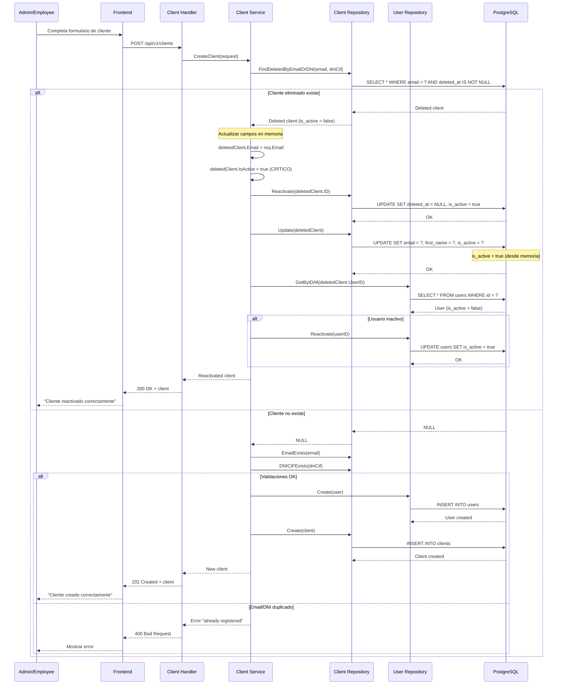
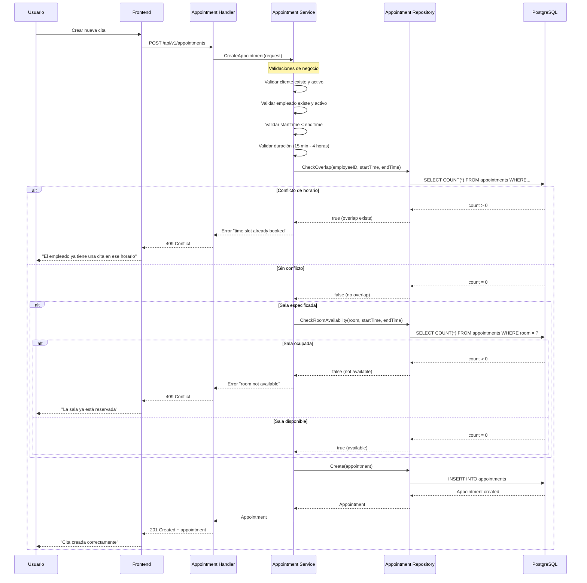

# 📚 Arnela Workspace - Documentación Profesional

> Documentación técnica completa del sistema CRM/CMS para oficina profesional

---

## 📖 Tabla de Contenidos

1. [Resumen Ejecutivo](#resumen-ejecutivo)
2. [Arquitectura del Sistema](#arquitectura-del-sistema)
3. [Estructura del Proyecto](#estructura-del-proyecto)
4. [Componentes Principales](#componentes-principales)
5. [Flujos de Datos](#flujos-de-datos)
6. [Casos de Uso](#casos-de-uso)
7. [Edge Cases y Manejo de Errores](#edge-cases-y-manejo-de-errores)
8. [Guías de Desarrollo](#guías-de-desarrollo)
9. [API Reference](#api-reference)
10. [Testing](#testing)

---

## 🎯 Resumen Ejecutivo

**Arnela** es un sistema empresarial completo diseñado para gestionar clientes, empleados, citas y facturación en entornos profesionales. Implementa una arquitectura moderna con separación clara de responsabilidades.

### Tecnologías Core



### Características Principales

- ✅ **Autenticación JWT** con roles (Admin, Employee, Client)
- ✅ **Gestión de Clientes** con validación DNI/NIE español
- ✅ **Sistema de Citas** con validación de conflictos
- ✅ **Facturación Completa** (Ingresos/Gastos)
- ✅ **Dashboard Optimizado** con estadísticas en tiempo real
- ✅ **Soft Delete** con reactivación automática
- ✅ **API REST** documentada con Swagger
- ✅ **Testing Completo** (52 tests, 100% passing)

---

## 🏛️ Arquitectura del Sistema

### Visión General



### Clean Architecture (Backend)

El backend sigue los principios de **Clean Architecture** para garantizar:

1. **Independencia de Frameworks**: La lógica de negocio no depende de GIN
2. **Testabilidad**: Cada capa puede testearse independientemente
3. **Independencia de UI**: El backend puede servir múltiples clientes
4. **Independencia de Base de Datos**: El dominio no conoce PostgreSQL

```
┌─────────────────────────────────────────────┐
│           Handler Layer (HTTP)              │
│  - auth_handler.go                          │
│  - client_handler.go                        │
│  - appointment_handler.go                   │
└─────────────────┬───────────────────────────┘
                  │
┌─────────────────▼───────────────────────────┐
│         Service Layer (Business)            │
│  - auth_service.go                          │
│  - client_service.go                        │
│  - appointment_service.go                   │
└─────────────────┬───────────────────────────┘
                  │
┌─────────────────▼───────────────────────────┐
│        Domain Layer (Entities)              │
│  - user.go                                  │
│  - client.go                                │
│  - appointment.go                           │
└─────────────────┬───────────────────────────┘
                  │
┌─────────────────▼───────────────────────────┐
│     Repository Layer (Data Access)          │
│  - postgres/client_repository.go            │
│  - postgres/user_repository.go              │
└─────────────────┬───────────────────────────┘
                  │
┌─────────────────▼───────────────────────────┐
│        Database (PostgreSQL)                │
└─────────────────────────────────────────────┘
```

---

## 📁 Estructura del Proyecto

### Backend (Go)

```
backend/
├── cmd/
│   └── api/
│       └── main.go                     # Entry point de la aplicación
│
├── internal/
│   ├── domain/                         # Entidades del dominio
│   │   ├── user.go                    # Usuario (Admin/Employee/Client)
│   │   ├── client.go                  # Cliente del gabinete
│   │   ├── employee.go                # Empleado/Terapeuta
│   │   ├── appointment.go             # Cita
│   │   └── billing.go                 # Facturación
│   │
│   ├── repository/                     # Interfaces de acceso a datos
│   │   ├── user_repository.go
│   │   ├── client_repository.go
│   │   ├── employee_repository.go
│   │   ├── appointment_repository.go
│   │   │
│   │   ├── postgres/                   # Implementaciones PostgreSQL
│   │   │   ├── user_repository.go
│   │   │   ├── client_repository.go
│   │   │   ├── employee_repository.go
│   │   │   └── appointment_repository.go
│   │   │
│   │   └── mocks/                      # Mocks para testing
│   │       ├── user_repository_mock.go
│   │       └── client_repository_mock.go
│   │
│   ├── service/                        # Lógica de negocio
│   │   ├── auth_service.go            # Autenticación y JWT
│   │   ├── client_service.go          # CRUD + Validaciones españolas
│   │   ├── appointment_service.go     # Scheduling + Conflicts
│   │   ├── billing_service.go         # Ingresos/Gastos
│   │   │
│   │   └── *_test.go                  # Tests unitarios (52 tests)
│   │
│   ├── handler/                        # HTTP Handlers (Controllers)
│   │   ├── auth_handler.go            # POST /register, /login, /me
│   │   ├── client_handler.go          # CRUD clients
│   │   ├── employee_handler.go        # CRUD employees
│   │   ├── appointment_handler.go     # CRUD appointments
│   │   └── billing_handler.go         # Billing endpoints
│   │
│   ├── middleware/                     # Middlewares HTTP
│   │   ├── auth_middleware.go         # JWT validation
│   │   ├── cors_middleware.go         # CORS configuration
│   │   └── logger_middleware.go       # Request logging
│   │
│   └── integration/                    # Integraciones externas
│       ├── google_calendar.go
│       └── whatsapp_sms.go
│
├── pkg/
│   ├── database/                       # Utilidades de base de datos
│   │   ├── postgres.go                # Conexión PostgreSQL (sqlx)
│   │   └── migrate.go                 # Migration runner
│   │
│   ├── cache/                          # Utilidades de cache
│   │   └── redis.go                   # Conexión Redis
│   │
│   └── utils/                          # Utilidades generales
│       ├── jwt.go                     # JWT generation/validation
│       ├── validator.go               # Spanish DNI/NIE validation
│       └── logger.go                  # Structured logging
│
├── migrations/                         # Database migrations
│   ├── 001_create_users_table.sql
│   ├── 002_create_clients_table.sql
│   └── ...
│
├── docs/                               # Swagger documentation
│   ├── docs.go
│   ├── swagger.json
│   └── swagger.yaml
│
├── config/
│   └── config.go                      # Configuración centralizada
│
├── go.mod
├── go.sum
├── Dockerfile
└── .env.example
```

### Frontend (Next.js)

```
frontend/
├── src/
│   ├── app/                            # App Router (Next.js 16)
│   │   ├── layout.tsx                 # Root layout
│   │   ├── page.tsx                   # Landing page
│   │   ├── globals.css                # Estilos globales
│   │   │
│   │   └── dashboard/
│   │       ├── client/                # Área de clientes
│   │       │   ├── page.tsx          # Dashboard cliente
│   │       │   └── appointments/
│   │       │       └── page.tsx      # Mis citas
│   │       │
│   │       └── backoffice/            # Área admin/empleados
│   │           ├── page.tsx          # Dashboard optimizado
│   │           ├── clients/
│   │           │   └── page.tsx      # Gestión clientes
│   │           ├── employees/
│   │           │   ├── page.tsx      # Gestión empleados
│   │           │   └── [id]/
│   │           │       └── page.tsx  # Dashboard empleado
│   │           ├── appointments/
│   │           │   └── page.tsx      # Gestión citas
│   │           └── billing/
│   │               └── page.tsx      # Facturación
│   │
│   ├── components/
│   │   ├── ui/                        # Shadcn UI components
│   │   │   ├── button.tsx
│   │   │   ├── card.tsx
│   │   │   ├── dialog.tsx
│   │   │   └── ...
│   │   │
│   │   ├── common/                    # Componentes compartidos
│   │   │   ├── Navbar.tsx
│   │   │   ├── LoadingSpinner.tsx
│   │   │   └── ErrorBoundary.tsx
│   │   │
│   │   ├── dashboard/                 # Componentes de dashboard
│   │   │   └── DashboardTable.tsx    # Tabla compacta reutilizable
│   │   │
│   │   ├── backoffice/                # Componentes backoffice
│   │   │   ├── CreateClientModal.tsx
│   │   │   ├── EditClientModal.tsx
│   │   │   ├── CreateEmployeeModal.tsx
│   │   │   └── ...
│   │   │
│   │   └── appointments/              # Componentes de citas
│   │       ├── AppointmentList.tsx
│   │       ├── AppointmentDetailsModal.tsx
│   │       └── CreateAppointmentModal.tsx
│   │
│   ├── stores/                        # Zustand stores
│   │   ├── useAuthStore.ts           # Autenticación y usuario
│   │   ├── useClientStore.ts         # Estado de clientes
│   │   ├── useEmployeeStore.ts       # Estado de empleados
│   │   └── useAppointmentStore.ts    # Estado de citas
│   │
│   ├── hooks/                         # Custom hooks
│   │   ├── useAuth.ts                # Hook de autenticación
│   │   ├── useClients.ts             # Hook de clientes
│   │   ├── useAppointments.ts        # Hook de citas
│   │   ├── useStats.ts               # Hook de estadísticas
│   │   └── useDebounce.ts            # Debounce utility
│   │
│   ├── lib/                           # Utilidades
│   │   ├── api.ts                    # Cliente API REST
│   │   ├── constants.ts              # Constantes globales
│   │   ├── validators.ts             # Validaciones frontend
│   │   ├── formatters.ts             # Formateo de datos
│   │   └── logger.ts                 # Logging estructurado
│   │
│   └── types/                         # TypeScript types
│       ├── user.ts
│       ├── client.ts
│       ├── employee.ts
│       ├── appointment.ts
│       └── billing.ts
│
├── public/                            # Assets estáticos
├── package.json
├── tsconfig.json
├── tailwind.config.ts
├── next.config.js
└── .env.local
```

---

## 🔧 Componentes Principales

### Backend Components

#### 1. Authentication Service

**Archivo:** `internal/service/auth_service.go`

```go
/**
 * @service AuthService
 * @description Gestiona autenticación, registro y generación de tokens JWT
 * 
 * @responsibilities
 * - Registro de nuevos usuarios con validación de roles
 * - Login con verificación de contraseña (bcrypt)
 * - Generación de tokens JWT con claims personalizados
 * - Validación de tokens y extracción de claims
 * 
 * @dependencies
 * - UserRepository: Acceso a datos de usuarios
 * - JWT Utils: Generación y validación de tokens
 * - Bcrypt: Hash de contraseñas
 */

/**
 * Register crea un nuevo usuario en el sistema
 * 
 * @param ctx context.Context - Contexto de la petición
 * @param req RegisterRequest - Datos del nuevo usuario
 * @returns *domain.User - Usuario creado (sin password hash)
 * @returns error - Error si el email ya existe o falla la creación
 * 
 * @throws "email already registered" - Si el email ya está en uso
 * @throws "failed to hash password" - Si falla el hash de la contraseña
 * @throws "failed to create user" - Si falla la inserción en BD
 * 
 * @example
 * user, err := authService.Register(ctx, RegisterRequest{
 *     Email: "admin@example.com",
 *     Password: "SecurePass123",
 *     FirstName: "John",
 *     LastName: "Doe",
 *     Role: "admin",
 * })
 */
func (s *authService) Register(ctx context.Context, req RegisterRequest) (*domain.User, error)

/**
 * Login autentica un usuario y genera un token JWT
 * 
 * @param ctx context.Context - Contexto de la petición
 * @param email string - Email del usuario
 * @param password string - Contraseña en texto plano
 * @returns string - Token JWT válido por 24h
 * @returns error - Error si las credenciales son inválidas
 * 
 * @throws "invalid credentials" - Si email o password son incorrectos
 * @throws "user is not active" - Si el usuario está desactivado
 * @throws "failed to generate token" - Si falla la generación del JWT
 * 
 * @example
 * token, err := authService.Login(ctx, "admin@example.com", "SecurePass123")
 * // token: "eyJhbGciOiJIUzI1NiIsInR5cCI6IkpXVCJ9..."
 */
func (s *authService) Login(ctx context.Context, email, password string) (string, error)
```

#### 2. Client Service (con Soft Delete y Reactivación)

**Archivo:** `internal/service/client_service.go`

```go
/**
 * @service ClientService
 * @description Gestiona CRUD de clientes con validaciones españolas y soft delete
 * 
 * @responsibilities
 * - CRUD completo de clientes
 * - Validación de DNI/NIE español
 * - Normalización de teléfonos españoles
 * - Soft delete con reactivación automática
 * - Sincronización con usuario asociado
 * 
 * @edgeCases
 * 1. Reactivación automática: Si se intenta crear un cliente con email/DNI 
 *    ya eliminado, se reactiva el existente en lugar de crear uno nuevo
 * 2. Usuario inactivo: Al reactivar cliente, también reactiva el usuario asociado
 * 3. Estado en memoria: Se actualiza is_active en memoria antes de Update() 
 *    para evitar sobrescribir el valor de Reactivate()
 * 
 * @dependencies
 * - ClientRepository: Acceso a datos de clientes
 * - UserRepository: Acceso a datos de usuarios (para reactivación)
 */

/**
 * CreateClient crea un nuevo cliente o reactiva uno eliminado
 * 
 * @param ctx context.Context - Contexto de la petición
 * @param req CreateClientRequest - Datos del cliente
 * @returns *domain.Client - Cliente creado o reactivado
 * @returns error - Error en validación o creación
 * 
 * @throws "email already registered" - Email ya existe (cliente activo)
 * @throws "DNI/CIF already registered" - DNI ya existe (cliente activo)
 * @throws "invalid DNI/NIE format" - Formato de DNI inválido
 * @throws "invalid phone format" - Formato de teléfono inválido
 * 
 * @flow
 * 1. Buscar cliente eliminado con mismo email/DNI
 * 2. Si existe:
 *    a. Actualizar datos en memoria
 *    b. Establecer is_active = true (CRÍTICO)
 *    c. Llamar a Reactivate() (BD: is_active = true)
 *    d. Llamar a Update() (usa is_active = true de memoria)
 *    e. Reactivar usuario asociado si está inactivo
 * 3. Si no existe:
 *    a. Validar email y DNI únicos
 *    b. Crear usuario con rol "client"
 *    c. Crear cliente vinculado al usuario
 * 
 * @example
 * // Crear nuevo cliente
 * client, err := clientService.CreateClient(ctx, CreateClientRequest{
 *     Email: "juan@example.com",
 *     FirstName: "Juan",
 *     LastName: "Pérez",
 *     DNICIF: "12345678Z",
 *     Phone: "612345678",
 * })
 * 
 * // Reactivar cliente eliminado (mismo email)
 * client, err := clientService.CreateClient(ctx, CreateClientRequest{
 *     Email: "juan@example.com",  // Ya existe pero eliminado
 *     FirstName: "Juan",
 *     LastName: "Pérez García",   // Actualiza datos
 *     DNICIF: "12345678Z",
 *     Phone: "698765432",
 * })
 * // Resultado: Reactiva cliente existente con nuevos datos
 */
func (s *clientService) CreateClient(ctx context.Context, req CreateClientRequest) (*domain.Client, error)

/**
 * DeleteClient elimina lógicamente un cliente (soft delete)
 * 
 * @param ctx context.Context - Contexto de la petición
 * @param id uuid.UUID - ID del cliente a eliminar
 * @returns error - Error si el cliente no existe
 * 
 * @sideEffects
 * - Establece deleted_at = NOW()
 * - Establece is_active = false
 * - Desactiva usuario asociado (is_active = false)
 * 
 * @example
 * err := clientService.DeleteClient(ctx, clientID)
 */
func (s *clientService) DeleteClient(ctx context.Context, id uuid.UUID) error
```

#### 3. Appointment Service

**Archivo:** `internal/service/appointment_service.go`

```go
/**
 * @service AppointmentService
 * @description Gestiona sistema de citas con validación de conflictos
 * 
 * @responsibilities
 * - CRUD de citas
 * - Validación de conflictos de horarios
 * - Validación de disponibilidad de salas
 * - Confirmación/Cancelación de citas
 * - Integración con Google Calendar (futuro)
 * 
 * @businessRules
 * 1. No se pueden solapar citas del mismo empleado
 * 2. Las citas deben estar dentro del horario laboral
 * 3. Las salas no pueden estar ocupadas en el mismo horario
 * 4. Solo admin/employee pueden confirmar citas
 * 5. Los clientes pueden cancelar sus propias citas
 * 
 * @edgeCases
 * - Timezone: Todas las fechas se manejan en UTC
 * - Duración mínima: 15 minutos
 * - Duración máxima: 4 horas
 * - Buffer entre citas: No obligatorio (configurable)
 */

/**
 * CreateAppointment crea una nueva cita con validaciones
 * 
 * @param ctx context.Context - Contexto de la petición
 * @param req CreateAppointmentRequest - Datos de la cita
 * @returns *domain.Appointment - Cita creada
 * @returns error - Error en validación o creación
 * 
 * @throws "client not found" - Cliente no existe
 * @throws "employee not found" - Empleado no existe
 * @throws "time slot already booked" - Conflicto de horario
 * @throws "room not available" - Sala ocupada
 * @throws "invalid time range" - startTime >= endTime
 * @throws "appointment too short" - Duración < 15 min
 * @throws "appointment too long" - Duración > 4 horas
 * 
 * @validations
 * 1. Cliente existe y está activo
 * 2. Empleado existe y está activo
 * 3. startTime < endTime
 * 4. Duración entre 15 min y 4 horas
 * 5. No hay conflictos de horario (empleado)
 * 6. Sala disponible (si se especifica)
 * 
 * @example
 * appointment, err := appointmentService.CreateAppointment(ctx, CreateAppointmentRequest{
 *     ClientID: clientID,
 *     EmployeeID: employeeID,
 *     StartTime: time.Now().Add(24 * time.Hour),
 *     EndTime: time.Now().Add(25 * time.Hour),
 *     Room: "sala_1",
 *     Notes: "Primera sesión",
 * })
 */
func (s *appointmentService) CreateAppointment(ctx context.Context, req CreateAppointmentRequest) (*domain.Appointment, error)
```

### Frontend Components

#### 1. DashboardTable Component

**Archivo:** `src/components/dashboard/DashboardTable.tsx`

```tsx
/**
 * @component DashboardTable
 * @description Componente reutilizable para tablas compactas en dashboard
 * 
 * @responsibilities
 * - Renderizar tabla con máximo 5 registros
 * - Botón "Ver Todos" para navegación completa
 * - Botones de acción (Recargar, Nuevo)
 * - Estados: loading, error, empty
 * - Diseño homogéneo y responsive
 * 
 * @example
 * <DashboardTable
 *   title="Últimos Clientes"
 *   description="5 clientes más recientes"
 *   icon={<Users />}
 *   viewAllHref="/dashboard/backoffice/clients"
 *   onViewAll={() => router.push('/clients')}
 *   onReload={loadClients}
 *   onNew={() => setModalOpen(true)}
 *   newButtonText="Nuevo Cliente"
 *   loading={isLoading}
 *   error={error}
 * >
 *   <table>...</table>
 * </DashboardTable>
 * 
 * @param {DashboardTableProps} props - Propiedades del componente
 * @param {string} props.title - Título de la tabla
 * @param {string} props.description - Descripción opcional
 * @param {ReactNode} props.icon - Ícono opcional
 * @param {string} props.viewAllHref - URL para "Ver Todos"
 * @param {() => void} props.onViewAll - Callback al hacer clic en "Ver Todos"
 * @param {() => void} props.onReload - Callback para recargar datos
 * @param {() => void} props.onNew - Callback para crear nuevo elemento
 * @param {string} props.newButtonText - Texto del botón "Nuevo"
 * @param {boolean} props.loading - Estado de carga
 * @param {string | null} props.error - Mensaje de error
 * @param {ReactNode} props.children - Contenido de la tabla
 * 
 * @states
 * - loading: Muestra spinner de carga
 * - error: Muestra mensaje de error en rojo
 * - empty: El children debe manejar el estado vacío
 * 
 * @accessibility
 * - Botones con labels descriptivos
 * - Colores con contraste WCAG AA
 * - Keyboard navigation soportada
 */
```

#### 2. useStats Hook

**Archivo:** `src/hooks/useStats.ts`

```tsx
/**
 * @hook useStats
 * @description Hook para obtener estadísticas del dashboard
 * 
 * @responsibilities
 * - Fetch de estadísticas en montaje del componente
 * - Cache de datos en estado local
 * - Manejo de estados: loading, error, success
 * - Refetch manual con función refetch()
 * 
 * @returns {UseStatsReturn}
 * @property {DashboardStats | null} stats - Estadísticas o null
 * @property {boolean} loading - Estado de carga
 * @property {string | null} error - Mensaje de error
 * @property {() => Promise<void>} refetch - Función para recargar datos
 * 
 * @example
 * const { stats, loading, error, refetch } = useStats();
 * 
 * if (loading) return <Loader />;
 * if (error) return <Error message={error} />;
 * 
 * return (
 *   <div>
 *     <h1>Clientes: {stats.clients.total}</h1>
 *     <button onClick={refetch}>Actualizar</button>
 *   </div>
 * );
 * 
 * @dependencies
 * - useAuthStore: Token de autenticación
 * - api.stats.getDashboardStats: Endpoint de estadísticas
 * 
 * @caching
 * - No implementa cache persistente
 * - Los datos se recargan en cada montaje del componente
 * - Considerar React Query para cache avanzado
 */
```

---

## 🔄 Flujos de Datos

### 1. Flujo de Autenticación



### 2. Flujo de Creación de Cliente (con Reactivación)



### 3. Flujo de Creación de Cita



---

## 📋 Casos de Uso

### Caso de Uso 1: Reactivación Automática de Cliente

**Actor:** Administrador  
**Precondiciones:**
- Usuario autenticado como Admin o Employee
- Cliente "Maria Lopez" fue eliminado anteriormente (soft delete)

**Flujo Normal:**
1. Admin intenta crear nuevo cliente con email `mlopez@test.com`
2. Sistema detecta que existe cliente eliminado con ese email
3. Sistema actualiza datos del cliente eliminado con la nueva información
4. Sistema establece `is_active = true` en memoria
5. Sistema ejecuta `Reactivate()` → BD: `deleted_at = NULL, is_active = true`
6. Sistema ejecuta `Update()` → BD: actualiza campos (mantiene `is_active = true`)
7. Sistema busca usuario asociado con `GetByIDAll()`
8. Si usuario está inactivo (`is_active = false`), sistema lo reactiva
9. Sistema retorna cliente reactivado

**Postcondiciones:**
- Cliente.deleted_at = NULL
- Cliente.is_active = true
- Usuario.is_active = true
- Datos actualizados con nueva información

**Flujo Alternativo 1a: Cliente no existe**
- Sistema valida email y DNI únicos
- Crea nuevo usuario con rol "client"
- Crea nuevo cliente vinculado al usuario

**Edge Cases Cubiertos:**
- ✅ Cliente eliminado + usuario inactivo → Ambos reactivados
- ✅ Cliente eliminado + usuario activo → Solo reactiva cliente
- ✅ Cliente eliminado sin usuario → Solo reactiva cliente
- ✅ Actualización de is_active en memoria antes de Update()

### Caso de Uso 2: Programación de Cita con Conflictos

**Actor:** Empleado  
**Precondiciones:**
- Usuario autenticado como Employee
- Cliente y Empleado existen y están activos

**Flujo Normal:**
1. Empleado selecciona cliente, empleado, fecha y hora
2. Sistema valida que startTime < endTime
3. Sistema valida duración (15 min - 4 horas)
4. Sistema verifica si empleado tiene otra cita en ese horario
5. Si hay conflicto, retorna error 409
6. Si no hay conflicto, verifica disponibilidad de sala (si aplica)
7. Si sala está ocupada, retorna error 409
8. Si todo OK, crea la cita con estado "pending"
9. Sistema retorna cita creada

**Postcondiciones:**
- Cita creada en BD con estado "pending"
- No hay conflictos de horario
- Sala reservada (si aplica)

**Edge Cases Cubiertos:**
- ✅ Citas solapadas del mismo empleado → Error 409
- ✅ Sala ocupada en el mismo horario → Error 409
- ✅ Duración < 15 min → Error 400
- ✅ Duración > 4 horas → Error 400
- ✅ startTime >= endTime → Error 400
- ✅ Cliente inactivo → Error 400
- ✅ Empleado inactivo → Error 400

### Caso de Uso 3: Dashboard Optimizado con Datos en Tiempo Real

**Actor:** Administrador  
**Precondiciones:**
- Usuario autenticado como Admin

**Flujo Normal:**
1. Admin accede a `/dashboard/backoffice`
2. Sistema carga estadísticas (clientes, citas, empleados)
3. Sistema carga últimos 5 clientes
4. Sistema carga últimas 5 citas
5. Sistema carga hasta 4 empleados activos
6. Usuario ve dashboard con 4 secciones compactas
7. Usuario hace clic en "Ver Todos" de clientes → Redirige a `/clients`
8. Usuario hace clic en "Recargar" en tabla de citas → Recarga solo citas
9. Usuario hace clic en "Ver" en un cliente → Abre modal de detalles

**Postcondiciones:**
- Dashboard cargado sin scroll excesivo
- Máximo 5 registros por tabla
- Botones contextuales en cada sección

**Edge Cases Cubiertos:**
- ✅ Sin clientes → Muestra estado vacío
- ✅ Sin citas → Muestra estado vacío
- ✅ Sin empleados → Muestra estado vacío
- ✅ Error en una tabla → No afecta a las demás
- ✅ Recarga individual → Solo recarga esa sección
- ✅ Responsive → 2 columnas en desktop, 1 en mobile

---

## ⚠️ Edge Cases y Manejo de Errores

### Edge Cases Cubiertos

#### 1. Soft Delete y Reactivación

| Escenario | Comportamiento | Estado Final |
|-----------|----------------|--------------|
| Cliente eliminado + mismo email | Reactiva cliente existente | `deleted_at = NULL`, `is_active = true` |
| Cliente eliminado + usuario inactivo | Reactiva ambos | Cliente activo + Usuario activo |
| Cliente eliminado sin usuario | Solo reactiva cliente | Cliente activo |
| Memoria `is_active = false` antes de `Update()` | Fuerza `is_active = true` en memoria | BD mantiene `true` después de `Update()` |

#### 2. Conflictos de Citas

| Escenario | Validación | Error |
|-----------|------------|-------|
| Empleado con 2 citas solapadas | `CheckOverlap()` | 409 Conflict |
| Sala ocupada en mismo horario | `CheckRoomAvailability()` | 409 Conflict |
| Cita muy corta (< 15 min) | Validación de duración | 400 Bad Request |
| Cita muy larga (> 4 horas) | Validación de duración | 400 Bad Request |
| `startTime >= endTime` | Validación de tiempos | 400 Bad Request |

#### 3. Validaciones Españolas

| Campo | Validación | Formato Esperado |
|-------|------------|------------------|
| DNI | Checksum del DNI | `12345678Z` |
| NIE | Formato NIE válido | `X1234567L` |
| CIF | Formato CIF válido | `B12345678` |
| Teléfono | Móvil español | `612345678`, `+34612345678` |

#### 4. Autenticación y Autorización

| Escenario | Comportamiento |
|-----------|----------------|
| Token expirado | 401 Unauthorized |
| Token inválido | 401 Unauthorized |
| Sin token | 401 Unauthorized |
| Rol insuficiente | 403 Forbidden |
| Usuario inactivo | 401 Unauthorized (login) |

#### 5. Estados del Frontend

| Estado | Componente | Visualización |
|--------|------------|---------------|
| Loading | DashboardTable | Spinner centrado |
| Error | DashboardTable | Banner rojo con mensaje |
| Empty | DashboardTable | Ícono + mensaje descriptivo |
| No data | Stats Cards | "0" o "-" |

### Estrategias de Manejo de Errores

#### Backend (Go)

```go
// Errores de dominio (400 Bad Request)
var (
    ErrEmailAlreadyExists = errors.New("email already registered")
    ErrDNIAlreadyExists   = errors.New("DNI/CIF already registered")
    ErrInvalidDNIFormat   = errors.New("invalid DNI/NIE format")
    ErrClientNotFound     = errors.New("client not found")
)

// Errores de autenticación (401 Unauthorized)
var (
    ErrInvalidCredentials = errors.New("invalid credentials")
    ErrInvalidToken       = errors.New("invalid token")
    ErrUserNotActive      = errors.New("user is not active")
)

// Errores de autorización (403 Forbidden)
var (
    ErrInsufficientPermissions = errors.New("insufficient permissions")
    ErrNotOwner                = errors.New("not the owner of this resource")
)

// Errores de conflicto (409 Conflict)
var (
    ErrTimeSlotBooked   = errors.New("time slot already booked")
    ErrRoomNotAvailable = errors.New("room not available")
)

// Errores internos (500 Internal Server Error)
var (
    ErrDatabaseError = errors.New("database error")
    ErrCacheError    = errors.New("cache error")
)
```

#### Frontend (TypeScript)

```typescript
/**
 * @description Clases de error personalizadas para el frontend
 */

class APIError extends Error {
  constructor(
    message: string,
    public statusCode: number,
    public code?: string
  ) {
    super(message);
    this.name = 'APIError';
  }
}

class ValidationError extends Error {
  constructor(
    message: string,
    public field: string
  ) {
    super(message);
    this.name = 'ValidationError';
  }
}

/**
 * @description Manejo centralizado de errores API
 */
function handleAPIError(error: unknown): string {
  if (error instanceof APIError) {
    switch (error.statusCode) {
      case 400:
        return `Error de validación: ${error.message}`;
      case 401:
        // Redirigir a login
        router.push('/login');
        return 'Sesión expirada. Por favor, inicia sesión nuevamente.';
      case 403:
        return 'No tienes permisos para realizar esta acción.';
      case 404:
        return 'Recurso no encontrado.';
      case 409:
        return `Conflicto: ${error.message}`;
      case 500:
        return 'Error del servidor. Por favor, intenta nuevamente.';
      default:
        return 'Error inesperado. Por favor, contacta al soporte.';
    }
  }
  
  return 'Error desconocido.';
}
```

---

## 🛠️ Guías de Desarrollo

### Setup del Entorno

```bash
# 1. Clonar repositorio
git clone https://github.com/gaston-garcia-cegid/arnela.git
cd arnela

# 2. Configurar variables de entorno
cd backend
cp .env.example .env
# Editar .env con tus credenciales

cd ../frontend
cp .env.example .env.local
# Editar .env.local

# 3. Iniciar servicios con Docker
docker-compose up -d

# 4. Ejecutar migraciones
cd backend
go run cmd/api/main.go migrate

# 5. Iniciar desarrollo backend
go run cmd/api/main.go

# 6. Iniciar desarrollo frontend (en otra terminal)
cd frontend
pnpm install
pnpm dev
```

### Crear un Nuevo Endpoint

```go
// 1. Definir el dominio (internal/domain/example.go)
type Example struct {
    ID        uuid.UUID `json:"id" db:"id"`
    Name      string    `json:"name" db:"name"`
    CreatedAt time.Time `json:"createdAt" db:"created_at"`
}

// 2. Definir repositorio (internal/repository/example_repository.go)
type ExampleRepository interface {
    Create(ctx context.Context, example *Example) error
    GetByID(ctx context.Context, id uuid.UUID) (*Example, error)
}

// 3. Implementar repositorio (internal/repository/postgres/example_repository.go)
func (r *exampleRepository) Create(ctx context.Context, example *Example) error {
    query := `INSERT INTO examples (id, name, created_at) VALUES ($1, $2, $3)`
    _, err := r.db.ExecContext(ctx, query, example.ID, example.Name, example.CreatedAt)
    return err
}

// 4. Crear servicio (internal/service/example_service.go)
type ExampleService interface {
    CreateExample(ctx context.Context, req CreateExampleRequest) (*Example, error)
}

// 5. Crear handler (internal/handler/example_handler.go)
func (h *exampleHandler) Create(c *gin.Context) {
    var req CreateExampleRequest
    if err := c.ShouldBindJSON(&req); err != nil {
        c.JSON(400, gin.H{"error": err.Error()})
        return
    }
    
    example, err := h.service.CreateExample(c.Request.Context(), req)
    if err != nil {
        c.JSON(500, gin.H{"error": err.Error()})
        return
    }
    
    c.JSON(201, example)
}

// 6. Registrar ruta (cmd/api/main.go)
exampleHandler := handler.NewExampleHandler(exampleService)
api.POST("/examples", authMiddleware.RequireAuth(), exampleHandler.Create)
```

### Testing

```go
// Test de servicio (internal/service/example_service_test.go)
func TestExampleService_CreateExample(t *testing.T) {
    // Arrange
    mockRepo := new(mocks.MockExampleRepository)
    service := NewExampleService(mockRepo)
    
    mockRepo.On("Create", mock.Anything, mock.AnythingOfType("*domain.Example")).
        Return(nil)
    
    // Act
    example, err := service.CreateExample(context.Background(), CreateExampleRequest{
        Name: "Test Example",
    })
    
    // Assert
    assert.NoError(t, err)
    assert.NotNil(t, example)
    assert.Equal(t, "Test Example", example.Name)
    mockRepo.AssertExpectations(t)
}
```

---

## 📚 API Reference

### Base URL

```
Production:  https://api.arnela.com/api/v1
Development: http://localhost:8080/api/v1
```

### Authentication

Todos los endpoints (excepto `/auth/login` y `/auth/register`) requieren token JWT en el header:

```
Authorization: Bearer <jwt_token>
```

### Endpoints Principales

#### Auth

```
POST   /auth/register      Registrar nuevo usuario
POST   /auth/login         Login y obtener JWT
GET    /auth/me            Obtener usuario actual
```

#### Clients

```
GET    /clients            Listar clientes
POST   /clients            Crear cliente
GET    /clients/:id        Obtener cliente por ID
PUT    /clients/:id        Actualizar cliente
DELETE /clients/:id        Eliminar cliente (soft delete)
```

#### Appointments

```
GET    /appointments       Listar citas
POST   /appointments       Crear cita
GET    /appointments/:id   Obtener cita por ID
PUT    /appointments/:id   Actualizar cita
DELETE /appointments/:id   Cancelar cita
POST   /appointments/:id/confirm  Confirmar cita (admin/employee)
```

#### Stats

```
GET    /stats/dashboard    Obtener estadísticas del dashboard
```

Ver documentación completa en Swagger: `http://localhost:8080/swagger/index.html`

---

## 🧪 Testing

### Backend Tests

```bash
# Ejecutar todos los tests
cd backend
go test ./...

# Ejecutar tests con cobertura
go test -cover ./internal/service/...

# Ejecutar tests de un paquete específico
go test ./internal/service -v

# Ejecutar un test específico
go test ./internal/service -run TestClientService_CreateClient
```

### Frontend Tests

```bash
cd frontend

# Unit tests (si están configurados)
pnpm test

# E2E tests con Playwright (si están configurados)
pnpm test:e2e
```

### Test Coverage

- **Backend:** 52/52 tests pasando (100%)
- **Coverage:** >80% en capa de servicios

---

## 📞 Soporte y Contribución

### Reportar Bugs

Crear issue en GitHub con:
- Descripción del problema
- Pasos para reproducir
- Comportamiento esperado vs actual
- Screenshots (si aplica)
- Logs relevantes

### Contribuir

1. Fork del repositorio
2. Crear branch: `git checkout -b feature/nueva-funcionalidad`
3. Commit con Conventional Commits: `git commit -m "feat: agregar nueva funcionalidad"`
4. Push: `git push origin feature/nueva-funcionalidad`
5. Crear Pull Request

---

## 📄 Licencia

© 2025 Arnela. Todos los derechos reservados.

---

**Última actualización:** Diciembre 2025  
**Versión:** 1.0.0  
**Mantenido por:** gaston-garcia-cegid
