# 📊 Diagramas de Arquitectura - Arnela

> Visualizaciones técnicas del sistema CRM/CMS

---

## 📑 Índice

1. [Arquitectura General](#1-arquitectura-general)
2. [Flujo de Autenticación](#2-flujo-de-autenticación)
3. [Flujo de Reactivación de Cliente](#3-flujo-de-reactivación-de-cliente)
4. [Flujo de Creación de Cita](#4-flujo-de-creación-de-cita)
5. [Dashboard Data Flow](#5-dashboard-data-flow)
6. [Jerarquía de Componentes Frontend](#6-jerarquía-de-componentes-frontend)
7. [Base de Datos - Relaciones](#7-base-de-datos---relaciones)
8. [Estados de Citas](#8-estados-de-citas)
9. [Arquitectura Clean (Backend)](#9-arquitectura-clean-backend)
10. [Deployment Architecture](#10-deployment-architecture)

---

## 1. Arquitectura General

### Sistema Completo


### Clean Architecture Layers


---

## 2. Flujo de Autenticación

### Login Flow


### JWT Middleware


---

## 3. Flujo de Reactivación de Cliente

### CreateClient con Soft Delete Detection

```mermaid
sequenceDiagram
    actor Admin
    participant Frontend
    participant ClientHandler
    participant ClientService
    participant ClientRepo
    participant UserRepo
    participant PostgreSQL
    
    Admin->>Frontend: Crear cliente con<br/>email "maria@test.com"
    Frontend->>ClientHandler: POST /api/v1/clients<br/>{email, firstName, lastName, dniCif}
    
    ClientHandler->>ClientService: CreateClient(ctx, request)
    
    Note over ClientService: PASO 1: Buscar cliente eliminado
    ClientService->>ClientRepo: FindDeletedByEmailOrDNI(email, dniCif)
    ClientRepo->>PostgreSQL: SELECT * FROM clients<br/>WHERE (email = $1 OR dnicif = $2)<br/>AND deleted_at IS NOT NULL
    
    alt Cliente eliminado encontrado
        PostgreSQL-->>ClientRepo: Deleted client row<br/>(is_active = false)
        ClientRepo-->>ClientService: deletedClient object
        
        Note over ClientService: PASO 2: Actualizar en memoria
        ClientService->>ClientService: deletedClient.Email = request.Email<br/>deletedClient.FirstName = request.FirstName<br/>deletedClient.IsActive = TRUE ⚠️
        
        Note over ClientService: PASO 3: Reactivar en BD
        ClientService->>ClientRepo: Reactivate(deletedClient.ID)
        ClientRepo->>PostgreSQL: UPDATE clients SET<br/>deleted_at = NULL,<br/>is_active = TRUE<br/>WHERE id = $1
        PostgreSQL-->>ClientRepo: OK
        
        Note over ClientService: PASO 4: Actualizar campos
        ClientService->>ClientRepo: Update(deletedClient)
        ClientRepo->>PostgreSQL: UPDATE clients SET<br/>email = $1,<br/>first_name = $2,<br/>is_active = $3 (TRUE desde memoria)
        PostgreSQL-->>ClientRepo: OK
        
        Note over ClientService: PASO 5: Reactivar usuario
        ClientService->>UserRepo: GetByIDAll(deletedClient.UserID)
        UserRepo->>PostgreSQL: SELECT * FROM users<br/>WHERE id = $1<br/>(sin filtro is_active)
        PostgreSQL-->>UserRepo: User (is_active = false)
        
        alt Usuario inactivo
            ClientService->>UserRepo: Reactivate(userID)
            UserRepo->>PostgreSQL: UPDATE users SET<br/>is_active = TRUE<br/>WHERE id = $1
            PostgreSQL-->>UserRepo: OK
        end
        
        ClientService-->>ClientHandler: Reactivated client
        ClientHandler-->>Frontend: 200 OK<br/>{client, message: "Cliente reactivado"}
        Frontend-->>Admin: ✅ "Cliente reactivado correctamente"
        
    else Cliente no existe
        PostgreSQL-->>ClientRepo: NULL
        ClientRepo-->>ClientService: NULL
        
        Note over ClientService: Flujo normal de creación
        ClientService->>ClientRepo: EmailExists(email)
        ClientService->>ClientRepo: DNICIFExists(dniCif)
        
        alt Email/DNI único
            ClientService->>UserRepo: Create(newUser)
            UserRepo->>PostgreSQL: INSERT INTO users
            PostgreSQL-->>UserRepo: Created user
            
            ClientService->>ClientRepo: Create(newClient)
            ClientRepo->>PostgreSQL: INSERT INTO clients
            PostgreSQL-->>ClientRepo: Created client
            
            ClientService-->>ClientHandler: New client
            ClientHandler-->>Frontend: 201 Created<br/>{client}
            Frontend-->>Admin: ✅ "Cliente creado correctamente"
        else Email/DNI duplicado
            ClientService-->>ClientHandler: Error "already registered"
            ClientHandler-->>Frontend: 400 Bad Request
            Frontend-->>Admin: ❌ Error de validación
        end
    end
```



### Bug Fix: is_active Memory Synchronization

```mermaid
graph TD
    A[Cliente eliminado<br/>BD: is_active = false] --> B{FindDeletedByEmailOrDNI}
    B -->|Found| C[Memory: deletedClient<br/>is_active = false ❌]
    C --> D[🔧 FIX: deletedClient.IsActive = true]
    D --> E[Reactivate BD<br/>is_active = true ✅]
    E --> F[Update BD<br/>usa is_active de memoria ✅]
    F --> G[✅ RESULTADO FINAL<br/>BD: is_active = true]
    
    C -.->|Sin fix| H[Update BD<br/>is_active = false ❌]
    H -.->|Bug| I[❌ BD: is_active = false<br/>aunque Reactivate lo puso true]
    
    style D fill:#90ee90
    style G fill:#90ee90
    style I fill:#ff6b6b
```



---

## 4. Flujo de Creación de Cita

### Appointment Creation with Conflict Detection

```mermaid
sequenceDiagram
    actor Usuario
    participant Frontend
    participant ApptHandler
    participant ApptService
    participant ApptRepo
    participant ClientRepo
    participant EmployeeRepo
    participant PostgreSQL
    
    Usuario->>Frontend: Crear cita<br/>Cliente: Juan<br/>Empleado: María<br/>14:00 - 15:00
    Frontend->>ApptHandler: POST /api/v1/appointments<br/>{clientID, employeeID, startTime, endTime}
    
    ApptHandler->>ApptService: CreateAppointment(ctx, request)
    
    Note over ApptService: VALIDACIÓN 1: Cliente existe
    ApptService->>ClientRepo: GetByID(clientID)
    ClientRepo->>PostgreSQL: SELECT * FROM clients<br/>WHERE id = $1 AND is_active = TRUE
    
    alt Cliente no encontrado
        PostgreSQL-->>ClientRepo: NULL
        ClientRepo-->>ApptService: Error "not found"
        ApptService-->>ApptHandler: Error "client not found"
        ApptHandler-->>Frontend: 404 Not Found
        Frontend-->>Usuario: ❌ Error: Cliente no existe
    end
    
    Note over ApptService: VALIDACIÓN 2: Empleado existe
    ApptService->>EmployeeRepo: GetByID(employeeID)
    EmployeeRepo->>PostgreSQL: SELECT * FROM employees<br/>WHERE id = $1 AND is_active = TRUE
    
    alt Empleado no encontrado
        PostgreSQL-->>EmployeeRepo: NULL
        EmployeeRepo-->>ApptService: Error "not found"
        ApptService-->>ApptHandler: Error "employee not found"
        ApptHandler-->>Frontend: 404 Not Found
        Frontend-->>Usuario: ❌ Error: Empleado no existe
    end
    
    Note over ApptService: VALIDACIÓN 3: Tiempos válidos
    ApptService->>ApptService: Verificar startTime < endTime
    ApptService->>ApptService: Verificar duración (15 min - 4 horas)
    
    alt Tiempos inválidos
        ApptService-->>ApptHandler: Error "invalid time range"
        ApptHandler-->>Frontend: 400 Bad Request
        Frontend-->>Usuario: ❌ Error de validación
    end
    
    Note over ApptService: VALIDACIÓN 4: Conflictos de horario
    ApptService->>ApptRepo: CheckOverlap(employeeID, startTime, endTime)
    ApptRepo->>PostgreSQL: SELECT COUNT(*) FROM appointments<br/>WHERE employee_id = $1<br/>AND status != 'cancelled'<br/>AND (<br/>  (start_time <= $2 AND end_time > $2) OR<br/>  (start_time < $3 AND end_time >= $3)<br/>)
    
    alt Conflicto detectado
        PostgreSQL-->>ApptRepo: count > 0
        ApptRepo-->>ApptService: TRUE (overlap exists)
        ApptService-->>ApptHandler: Error "time slot already booked"
        ApptHandler-->>Frontend: 409 Conflict
        Frontend-->>Usuario: ❌ El empleado ya tiene una cita<br/>en ese horario
    else Sin conflicto
        PostgreSQL-->>ApptRepo: count = 0
        ApptRepo-->>ApptService: FALSE (no overlap)
        
        Note over ApptService: VALIDACIÓN 5: Sala disponible (opcional)
        alt Sala especificada
            ApptService->>ApptRepo: CheckRoomAvailability(room, startTime, endTime)
            ApptRepo->>PostgreSQL: SELECT COUNT(*) FROM appointments<br/>WHERE room = $1 AND...
            
            alt Sala ocupada
                PostgreSQL-->>ApptRepo: count > 0
                ApptRepo-->>ApptService: FALSE
                ApptService-->>ApptHandler: Error "room not available"
                ApptHandler-->>Frontend: 409 Conflict
                Frontend-->>Usuario: ❌ La sala ya está reservada
            end
        end
        
        Note over ApptService: CREACIÓN: Todas las validaciones OK
        ApptService->>ApptRepo: Create(appointment)
        ApptRepo->>PostgreSQL: INSERT INTO appointments<br/>(id, client_id, employee_id,<br/>start_time, end_time, status, ...)
        PostgreSQL-->>ApptRepo: Created appointment
        ApptRepo-->>ApptService: Appointment object
        ApptService-->>ApptHandler: Appointment
        ApptHandler-->>Frontend: 201 Created<br/>{appointment}
        Frontend-->>Usuario: ✅ Cita creada correctamente
    end
```



---

## 5. Dashboard Data Flow

### Optimized Dashboard Loading


### Component Hierarchy


---

## 6. Jerarquía de Componentes Frontend

### App Structure (Next.js 16)

```mermaid
graph TB
    ROOT[app/layout.tsx<br/>Root Layout]
    
    subgraph "Public Pages"
        HOME[app/page.tsx<br/>Landing Page]
        LOGIN[app/login/page.tsx<br/>Login Page]
    end
    
    subgraph "Dashboard Layout"
        DASH_LAYOUT[app/dashboard/layout.tsx<br/>Dashboard Layout + Navbar]
        
        subgraph "Client Area"
            CLIENT_DASH[app/dashboard/client/page.tsx<br/>Client Dashboard]
            CLIENT_APPTS[app/dashboard/client/appointments/page.tsx]
        end
        
        subgraph "Backoffice Area"
            BO_DASH[app/dashboard/backoffice/page.tsx<br/>Admin Dashboard]
            BO_CLIENTS[app/dashboard/backoffice/clients/page.tsx]
            BO_EMPLOYEES[app/dashboard/backoffice/employees/page.tsx]
            BO_EMP_DETAIL[app/dashboard/backoffice/employees/[id]/page.tsx]
            BO_APPTS[app/dashboard/backoffice/appointments/page.tsx]
            BO_BILLING[app/dashboard/backoffice/billing/page.tsx]
        end
    end
    
    ROOT --> HOME
    ROOT --> LOGIN
    ROOT --> DASH_LAYOUT
    
    DASH_LAYOUT --> CLIENT_DASH
    DASH_LAYOUT --> CLIENT_APPTS
    
    DASH_LAYOUT --> BO_DASH
    DASH_LAYOUT --> BO_CLIENTS
    DASH_LAYOUT --> BO_EMPLOYEES
    DASH_LAYOUT --> BO_EMP_DETAIL
    DASH_LAYOUT --> BO_APPTS
    DASH_LAYOUT --> BO_BILLING
    
    style ROOT fill:#ffd700
    style DASH_LAYOUT fill:#87ceeb
    style BO_DASH fill:#90ee90
```

### Reusable Components


---

## 7. Base de Datos - Relaciones

### ER Diagram


### Soft Delete Pattern


---

## 8. Estados de Citas

### Appointment Status State Machine

```mermaid
stateDiagram-v2
    [*] --> Pending: Cliente crea cita
    
    Pending --> Confirmed: Admin/Employee confirma
    Pending --> Cancelled: Cliente/Admin cancela
    
    Confirmed --> Completed: Cita finalizada
    Confirmed --> Cancelled: Admin cancela
    
    Completed --> [*]
    Cancelled --> [*]
    
    note right of Pending
        Estado inicial
        Color: Amarillo
        Notificación pendiente
    end note
    
    note right of Confirmed
        Confirmada por staff
        Color: Azul
        Notificación enviada
    end note
    
    note right of Completed
        Cita realizada
        Color: Verde
        Facturación generada
    end note
    
    note right of Cancelled
        Cancelada por cualquier actor
        Color: Rojo
        Notificación de cancelación
    end note
```



---

## 9. Arquitectura Clean (Backend)

### Dependency Flow


### Testing Pyramid


---

## 10. Deployment Architecture

### Production Environment


### Docker Compose Structure


---

## 📚 Referencias

- **Clean Architecture**: Robert C. Martin
- **Domain-Driven Design**: Eric Evans
- **Mermaid Docs**: https://mermaid.js.org/
- **Next.js App Router**: https://nextjs.org/docs/app
- **PostgreSQL Docs**: https://www.postgresql.org/docs/

---

**Última actualización:** Diciembre 2025  
**Versión:** 1.0.0  
**Autor:** gaston-garcia-cegid
