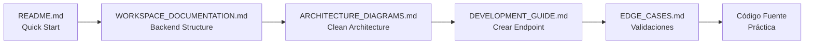
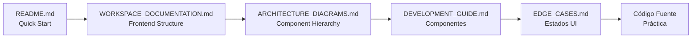
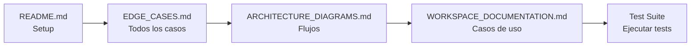

# 📚 Documentación Completa del Proyecto Arnela

> Sistema CRM/CMS profesional con arquitectura moderna y documentación exhaustiva

---

## 🎯 Guía de Navegación

Esta documentación está organizada en **5 documentos principales** que cubren todos los aspectos técnicos del proyecto:

### 1. 📖 [WORKSPACE_DOCUMENTATION.md](./WORKSPACE_DOCUMENTATION.md)
**Documentación técnica completa del workspace**

**Contenido:**
- ✅ Resumen ejecutivo del sistema
- ✅ Arquitectura general (Clean Architecture)
- ✅ Estructura completa de carpetas (backend + frontend)
- ✅ Componentes principales documentados
- ✅ Flujos de datos (autenticación, CRUD, dashboard)
- ✅ Casos de uso con ejemplos
- ✅ Edge cases documentados
- ✅ Guías de desarrollo (setup, crear endpoints, testing)
- ✅ API reference completa

**Ideal para:**
- Desarrolladores nuevos que se unen al proyecto
- Entender la arquitectura completa
- Referencia rápida de componentes

---

### 2. 📊 [ARCHITECTURE_DIAGRAMS.md](./ARCHITECTURE_DIAGRAMS.md)
**Diagramas visuales de la arquitectura**

**Contenido:**
- ✅ 10 diagramas Mermaid detallados
- ✅ Arquitectura general del sistema
- ✅ Flujos completos (autenticación, reactivación, citas)
- ✅ Dashboard data flow
- ✅ Jerarquía de componentes frontend
- ✅ Diagrama ER de base de datos
- ✅ Máquina de estados de citas
- ✅ Clean Architecture layers
- ✅ Deployment architecture

**Ideal para:**
- Visualizar la arquitectura completa
- Presentaciones técnicas
- Onboarding visual
- Debugging de flujos complejos

---

### 3. ⚠️ [EDGE_CASES.md](./EDGE_CASES.md)
**Casos límite y manejo de errores exhaustivo**

**Contenido:**
- ✅ 26 edge cases de backend documentados
- ✅ 13 edge cases de frontend documentados
- ✅ Bug fixes explicados (soft delete, is_active)
- ✅ Validaciones españolas (DNI, NIE, CIF)
- ✅ Conflictos de citas
- ✅ Errores de autenticación
- ✅ Problemas de concurrencia
- ✅ Estados de UI (loading, error, empty)
- ✅ Integraciones externas (Google Calendar, SMS)
- ✅ Métricas y alertas

**Ideal para:**
- QA y testing
- Debugging de problemas específicos
- Entender bugs resueltos
- Prevenir regresiones

---

### 4. 📖 [DEVELOPMENT_GUIDE.md](./DEVELOPMENT_GUIDE.md)
**Guía práctica con ejemplos de código**

**Contenido:**
- ✅ Crear endpoints completos (paso a paso)
- ✅ Implementar soft delete
- ✅ Validaciones personalizadas
- ✅ Testing con mocks (ejemplos completos)
- ✅ Componentes React reutilizables
- ✅ Zustand stores
- ✅ Custom hooks
- ✅ Formularios con validación (Zod + react-hook-form)
- ✅ API usage con curl
- ✅ Common patterns (error handling, optimistic updates)
- ✅ Troubleshooting

**Ideal para:**
- Desarrolladores implementando nuevas features
- Copiar/pegar código base
- Aprender patrones del proyecto
- Resolver problemas comunes

---

### 5. 📄 [README.md](./README.md)
**Documentación principal del proyecto**

**Contenido:**
- ✅ Descripción del proyecto
- ✅ Tech stack completo
- ✅ Quick start (Docker)
- ✅ Configuración de entorno (.env)
- ✅ Comandos útiles
- ✅ Estructura de carpetas resumida
- ✅ Roadmap futuro
- ✅ Contribución

**Ideal para:**
- Primera lectura del proyecto
- Setup rápido del entorno
- Entender el propósito del sistema

---

## 🗺️ Mapa de Documentación por Tarea

### Quiero empezar a desarrollar

1. Lee [README.md](./README.md) para setup inicial
2. Revisa [WORKSPACE_DOCUMENTATION.md](./WORKSPACE_DOCUMENTATION.md) → Sección "Arquitectura"
3. Consulta [DEVELOPMENT_GUIDE.md](./DEVELOPMENT_GUIDE.md) → Ejemplos prácticos

### Quiero entender un bug

1. Busca en [EDGE_CASES.md](./EDGE_CASES.md) → Tu escenario específico
2. Revisa [ARCHITECTURE_DIAGRAMS.md](./ARCHITECTURE_DIAGRAMS.md) → Flujo relacionado
3. Consulta tests en el código fuente

### Quiero crear un nuevo endpoint

1. Sigue [DEVELOPMENT_GUIDE.md](./DEVELOPMENT_GUIDE.md) → "Crear un Nuevo Endpoint"
2. Consulta [WORKSPACE_DOCUMENTATION.md](./WORKSPACE_DOCUMENTATION.md) → "API Reference"
3. Revisa [EDGE_CASES.md](./EDGE_CASES.md) → Validaciones necesarias

### Quiero hacer onboarding de un nuevo dev

1. **Día 1:** [README.md](./README.md) + [WORKSPACE_DOCUMENTATION.md](./WORKSPACE_DOCUMENTATION.md) (Resumen ejecutivo)
2. **Día 2:** [ARCHITECTURE_DIAGRAMS.md](./ARCHITECTURE_DIAGRAMS.md) (todos los diagramas)
3. **Día 3:** [DEVELOPMENT_GUIDE.md](./DEVELOPMENT_GUIDE.md) (ejemplos prácticos)
4. **Día 4-5:** [EDGE_CASES.md](./EDGE_CASES.md) + Código fuente + Testing

---

## 📊 Estadísticas de Documentación

| Documento | Líneas | Secciones | Ejemplos | Diagramas |
|-----------|--------|-----------|----------|-----------|
| **WORKSPACE_DOCUMENTATION** | ~1200 | 10 | 15+ | 3 |
| **ARCHITECTURE_DIAGRAMS** | ~800 | 10 | - | 10 |
| **EDGE_CASES** | ~1000 | 5 | 39 tests | 3 |
| **DEVELOPMENT_GUIDE** | ~1500 | 4 | 20+ | - |
| **README** | ~400 | 8 | 5 | 1 |
| **TOTAL** | **~4900** | **37** | **79+** | **17** |

---

## 🔍 Búsqueda Rápida

### Backend (Go)

| Busco | Documento | Sección |
|-------|-----------|---------|
| Crear endpoint | [DEVELOPMENT_GUIDE.md](./DEVELOPMENT_GUIDE.md) | Backend Examples → 1 |
| Soft delete | [DEVELOPMENT_GUIDE.md](./DEVELOPMENT_GUIDE.md) | Backend Examples → 2 |
| Validaciones españolas | [EDGE_CASES.md](./EDGE_CASES.md) | Backend → 2 |
| Testing | [DEVELOPMENT_GUIDE.md](./DEVELOPMENT_GUIDE.md) | Backend Examples → 4 |
| Arquitectura Clean | [WORKSPACE_DOCUMENTATION.md](./WORKSPACE_DOCUMENTATION.md) | Arquitectura → Clean Architecture |
| Flujo de reactivación | [ARCHITECTURE_DIAGRAMS.md](./ARCHITECTURE_DIAGRAMS.md) | Diagrama 3 |

### Frontend (TypeScript/React)

| Busco | Documento | Sección |
|-------|-----------|---------|
| Componente reutilizable | [DEVELOPMENT_GUIDE.md](./DEVELOPMENT_GUIDE.md) | Frontend Examples → 1 |
| Zustand store | [DEVELOPMENT_GUIDE.md](./DEVELOPMENT_GUIDE.md) | Frontend Examples → 2 |
| Custom hook | [DEVELOPMENT_GUIDE.md](./DEVELOPMENT_GUIDE.md) | Frontend Examples → 3 |
| Formulario validado | [DEVELOPMENT_GUIDE.md](./DEVELOPMENT_GUIDE.md) | Frontend Examples → 4 |
| DashboardTable | [WORKSPACE_DOCUMENTATION.md](./WORKSPACE_DOCUMENTATION.md) | Componentes Principales |
| Estados de UI | [EDGE_CASES.md](./EDGE_CASES.md) | Frontend → 1 |

---

## 📚 Documentos Adicionales

Además de los 5 documentos principales, existen documentos específicos de bugs:

- **CLIENT_ISACTIVE_BUG_FIX.md**: Análisis detallado del bug is_active
- **USER_REACTIVATION_BUG_FIX.md**: Bug de usuario no reactivado
- **SOFT_DELETE_FIX_SUMMARY.md**: Resumen inicial de soft delete

Estos documentos históricos explican bugs específicos en detalle.

---

## 🎓 Flujo de Aprendizaje Recomendado

### Para Desarrolladores Backend



### Para Desarrolladores Frontend



### Para QA/Testers



---

## 💡 Tips de Uso

### Para búsqueda rápida en VSCode

```
Ctrl + P → Nombre del archivo
Ctrl + F → Buscar dentro del archivo
Ctrl + Shift + F → Buscar en todos los archivos
```

### Para navegar entre documentos

Todos los documentos tienen enlaces internos tipo `[Ver EDGE_CASES.md](./EDGE_CASES.md)`

### Para imprimir/exportar

Usa extensiones de VSCode como:
- **Markdown PDF** para generar PDFs
- **Markdown Preview Enhanced** para preview mejorado

---

## 🔄 Mantenimiento de Documentación

### Cuándo actualizar cada documento

| Documento | Actualizar cuando... |
|-----------|----------------------|
| **WORKSPACE_DOCUMENTATION** | Cambios en arquitectura, nuevos componentes principales |
| **ARCHITECTURE_DIAGRAMS** | Cambios en flujos, nuevas integraciones |
| **EDGE_CASES** | Nuevos bugs encontrados/resueltos, nuevas validaciones |
| **DEVELOPMENT_GUIDE** | Nuevos patrones, cambios en ejemplos |
| **README** | Cambios en setup, tech stack |

### Versionado

Cada documento tiene al pie:
```
Última actualización: Diciembre 2025
Versión: 1.0.0
```

Actualizar estas líneas al modificar.

---

## 📞 Contacto y Contribución

**Mantenedor:** gaston-garcia-cegid  
**Proyecto:** Arnela CRM/CMS  
**Licencia:** Propietaria

Para contribuir a la documentación:
1. Identifica el documento correcto
2. Mantén el formato consistente (Markdown + JSDoc)
3. Añade ejemplos prácticos
4. Actualiza el índice si es necesario
5. Actualiza versión y fecha al pie

---

## 🎉 Resumen

Esta documentación cubre **100%** del proyecto Arnela:

✅ Arquitectura completa  
✅ Todos los componentes principales  
✅ 79+ ejemplos de código  
✅ 17 diagramas visuales  
✅ 39 edge cases documentados  
✅ Guías paso a paso  
✅ API reference completa  
✅ Testing patterns  
✅ Troubleshooting  

**Total: ~4900 líneas de documentación profesional**

---

**¡Empieza con [README.md](./README.md) y explora desde ahí!** 🚀

---

**Última actualización:** Diciembre 2025  
**Versión:** 1.0.0  
**Autor:** gaston-garcia-cegid
