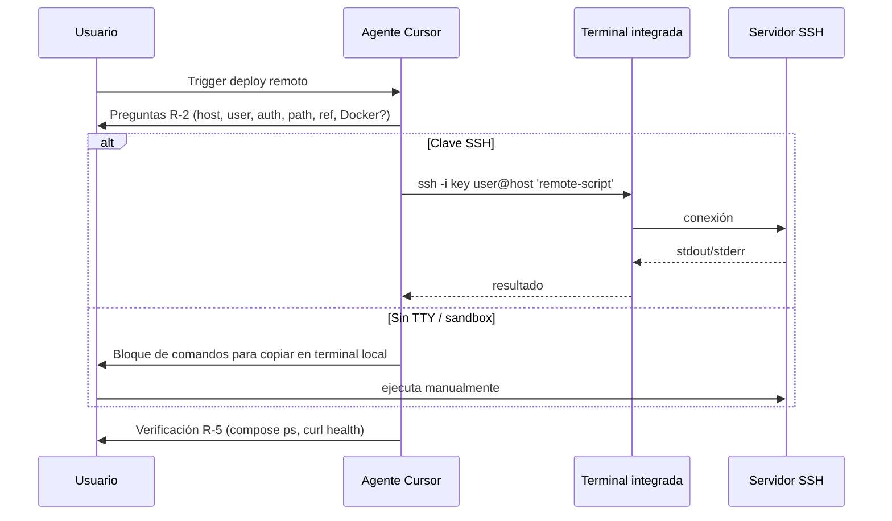

# Design: Skill `remote-deploy` + registro (registry + Engram)

**Change:** `add-remote-deploy-skill`  
**Spec:** `openspec/changes/add-remote-deploy-skill/specs/remote-server-deploy/spec.md`

---

## 1. Context

Implementar una **Cursor Agent Skill** que guíe despliegue remoto por **SSH** (preguntas → `git pull` → `docker compose` según `docs/DEPLOYMENT.md`), sin persistir secretos en el repositorio.

La skill debe **integrarse** con el inventario existente: actualizar **`.atl/skill-registry.md`** y **persistir en Engram** para que otros agentes / sesiones recuperen el mismo catálogo y reglas compactas.

---

## 2. Ubicación del artefacto `SKILL.md`

| Opción | Ruta | Pros | Contras |
|--------|------|------|---------|
| **A (recomendada para este repo)** | `d:\Repos\Arnela\.cursor\skills\remote-deploy\SKILL.md` | Versionada con git; todo el equipo ve la misma skill. | Path en registry debe ser **relativo al repo** o documentado para Windows/Linux. |
| **B** | `%USERPROFILE%\.cursor\skills\remote-deploy\SKILL.md` | Alineada con skills globales ya listadas en `.atl/skill-registry.md`. | No viaja en git salvo que cada dev la copie. |

**Decisión:** Implementar en **Opción A** (`.cursor/skills/remote-deploy/SKILL.md` dentro de Arnela). En **`.atl/skill-registry.md`** usar ruta **relativa al workspace**: `.cursor/skills/remote-deploy/SKILL.md` (portable entre máquinas). Opcionalmente duplicar en global (B) solo si un desarrollador quiere la skill fuera de Arnela.

---

## 3. Flujo de ejecución (agente)

**Remote script (Arnela + Docker)** — una sola cadena `bash -lc` remota, conceptualmente:

1. `cd "$REMOTE_REPO_PATH"`
2. `git fetch --all && git checkout <ref> && git pull` (o `git pull` si ya está en la rama)
3. `docker compose -f docker-compose.yml -f docker-compose.prod.yml --env-file .env.prod up -d --build`

Variables sensibles solo en servidor (`.env.prod`); la skill **no** las embebe en el comando salvo que el usuario confirme rutas ya existentes.

---

## 4. Registro en `.atl/skill-registry.md`

En fase **sdd-apply**:

1. Añadir fila en **User Skills** con trigger (ES/EN) y path **`.cursor/skills/remote-deploy/SKILL.md`**.
2. Añadir bloque **Compact Rules** (5–10 líneas): SSH no interactivo, Arnela compose, no secretos en chat, fallback usuario.

No eliminar filas existentes; mantener la nota de exclusión `sdd-*`.

---

## 5. Persistencia en Engram

Objetivo: que la skill quede **buscable** entre sesiones con el mismo criterio que `skill-registry` / `sdd-init`.

**Convención sugerida** (alineada a `_shared/engram-convention.md` y uso de `mem_save`):

| Campo | Valor sugerido |
|--------|----------------|
| `title` | `skill-registry` (upsert del registro completo) **o** `skills/arnela/remote-deploy` si se prefiere observación dedicada |
| `topic_key` | Igual que `title` para upsert estable |
| `type` | `config` |
| `project` | `Arnela` |
| `content` | Markdown: path de la skill, triggers, y **compact rules** idénticas o resumidas respecto a `.atl/skill-registry.md` |

**Procedimiento recomendado** (quien tenga MCP Engram activo):

1. Tras actualizar `.atl/skill-registry.md`, invocar **`mem_save`** con el **cuerpo completo** del registry actualizado (o solo el delta + pointer al path de la skill si el tamaño es límite).
2. Opcional: **`mem_search`** con `topic_key: skill-registry` antes de guardar para confirmar upsert vs duplicado.

> Nota: En esta sesión de agente no se invoca Engram automáticamente; la tarea **sdd-apply** o el usuario deben ejecutar `mem_save` cuando el MCP esté conectado.

---

## 6. Seguridad

- La skill documenta **preferencia** por `ssh -i /path/to/key` y `IdentitiesOnly=yes` cuando aplique.
- Contraseña SSH: solo en terminal **local** del usuario, no en el chat del agente si es evitable.
- No escribir `.env.prod` ni claves en commits; la skill solo referencia archivos ya en servidor.

---

## 7. Dependencias y prerequisitos

- Cliente OpenSSH en la máquina donde corre Cursor.
- Servidor: Docker + Compose + clone del repo + `.env.prod` (según DEPLOYMENT).
- Engram: MCP `engram` habilitado en Cursor (`.cursor/mcp.json`) para `mem_save`.

---

## 8. Criterios de aceptación (diseño → implementación)

- [ ] Existe `.cursor/skills/remote-deploy/SKILL.md` cumpliendo spec R-1–R-6.
- [ ] `.atl/skill-registry.md` incluye la skill y compact rules.
- [ ] Documentado en `tasks.md` (siguiente fase) el paso explícito **“mem_save registro en Engram”** post-merge del registry.

---

## 9. Riesgos residuales

| Riesgo | Mitigación en diseño |
|--------|----------------------|
| Engram no configurado en un dev | El registro en git (`.atl/`) sigue siendo fuente mínima compartida. |
| Paths absolutos Windows en registry antiguo | Nueva fila usa path relativo `.cursor/skills/...`. |
